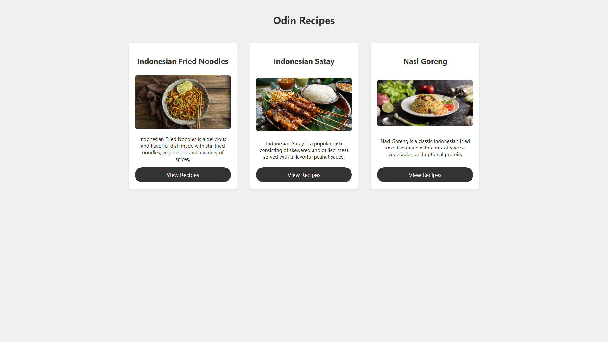

# Odin Recipes

Live preview (https://deafebrianoyuvica.github.io/odin-recipes/)

This project is part of [The Odin Project](https://www.theodinproject.com/paths/foundations/courses/foundations/lessons/recipes) curriculum. It is a basic website containing 3 recipe pages.

I also added simple **Cgit SS styling** to make the recipe pages look cleaner and more readable 🎨✨

---

## 🔗 Provided Assets

- Recipes reference: [all-recipes.com](https://www.all-recipes.com)

---

## 🎯 Objectives

1. Create a new directory within the `odin-recipes` directory and name it `recipes`.
2. Create a new HTML file within the `recipes` directory and name it after the recipe it will contain.
3. Add an `<h1>` heading with the recipe’s name as its content.
4. Add an image of the finished dish under the `<h1>` heading.
5. Add a `Description` section with an appropriately sized heading and a paragraph describing the recipe.
6. Add an `Ingredients` section with a `<ul>` (unordered list) of ingredients.
7. Add a `Steps` section with a `<ol>` (ordered list) of steps to make the dish.
8. Add two more recipes using the same page structure as the one already created.

---

## 💡 Bonus Improvement

- Added simple **CSS styling** using class-based layout:
  - Flexbox container for responsiveness
  - Styled recipe cards with shadows and padding
  - A fixed-position "Home" button on every page for easier navigation

---

## 🛠 Skills Learnt

- Basic HTML structure
- Index and multi-page site creation
- Linking between pages
- Embedding images
- Basic CSS styling with classes
- Fixed UI components
